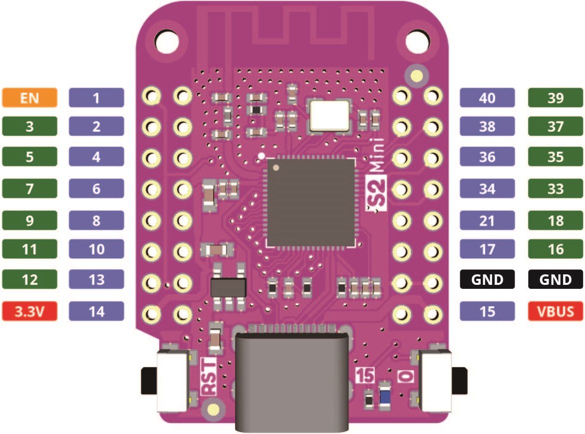
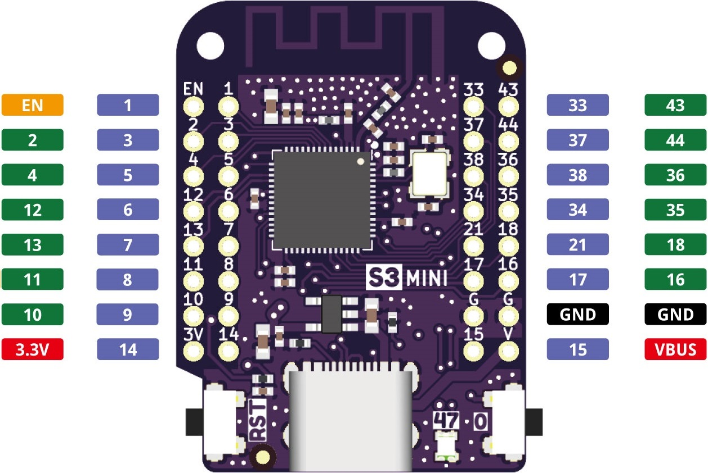
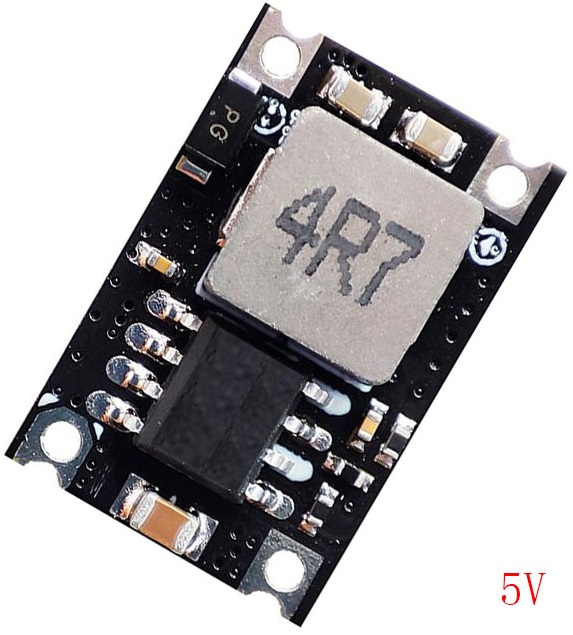
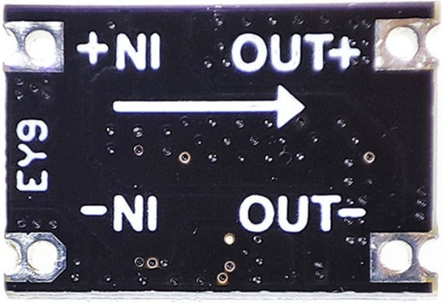

# Eagle-library

## Components in the library

| Part                | Status        | Description                          | URL to source                                  |
|---------------------|---------------|--------------------------------------|------------------------------------------------|
| Wemos D1 Mini ESP32 | Not completed |                                      |                                                |
| Wemos S2 Mini       | Completed     |                                      | https://www.wemos.cc/en/latest/s2/s2_mini.html |
| Wemos S3 Mini       | Completed     |                                      | https://www.wemos.cc/en/latest/s3/s3_mini.html |
| DC 360 Mini         | Not completed | DC/DC module with variable output    |                                                |
| EY9                 | Not completed | DC/DC module with fixed output       |                                                |
|                     |               |                                      |                                                |

Hole size needs to be adjusted!

## Pinout/pictures

### D1 Mini ESP32

### S2 Mini

### S3 Mini

### DC 360 Mini
 

### EY9
 

